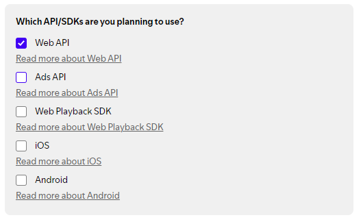
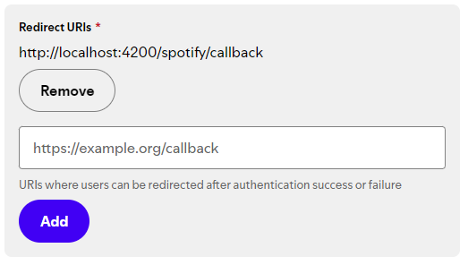
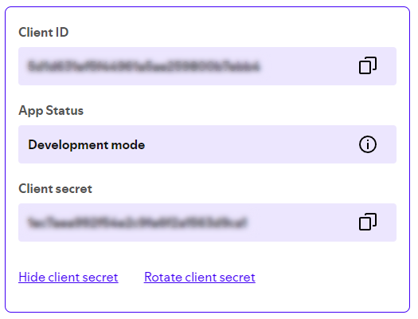

<h1>StatsSpotify</h1>
<h3>Basic web-app for checking some Spotify stats</h3>

### Running
1. **Clone the repo:** clone the repo to a folder and access on your terminal:

   ```
   git clone https://github.com/ligeirin/spotify-stats
   ```

2. **Install packages:** make sure all dependecies are installed

   ```sh
   npm install
   ```

3. **Spotify Web Credentials:** access the [Spotify Developer Dashboard](https://developer.spotify.com/dashboard) and create or access a app with the Web API enabled:


4. **Spotify Callback:** make sure [http://localhost:4200/spotify/callback](http://localhost:4200/spotify/callback) is added to your app's callback routes:


5. **Spotify Credentials:** access your app settings and copy your **Client ID** and **Client secret** to environment files:


6. **Run the project:** now you can run the project using:
  ```sh
  npm run start
  ```